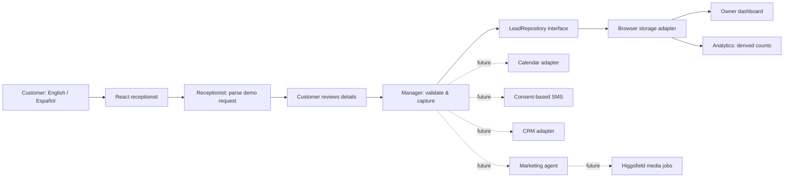

<div align="center">

# AutoFlow AI

### Hola. Hello. You’re in good hands.

A bilingual front desk for the businesses that keep Miami moving.

**React · TypeScript · Vite · English + Español**

[Explore the code](src) · [Architecture](docs/ARCHITECTURE.md) · [Demo walkthrough](docs/DEMO.md) · [Integration roadmap](docs/INTEGRATIONS.md)

</div>

## Why AutoFlow?

A busy independent shop cannot answer every question while working on a car. AutoFlow explores a warmer, more organized first contact: understand what a customer needs, collect the right details, and give the owner a clear follow-up queue.

Built by **Pablo Murillo** as a portfolio project and a foundation for a future small-business automation product. The fictional **Miami Auto Care** workspace demonstrates the first step toward a manager, receptionist, marketing, and analytics agent team.

## What works in v0.1

- **Bilingual receptionist:** English and Spanish interface, manual language switching, and lightweight recognition of Spanish and mixed-language requests.
- **Service intake:** brakes, oil changes, tires, A/C, and general inspections. Detects common vehicle makes and asks customers to review the result.
- **Appointment requests:** customer/contact details, vehicle, notes, preferred future date and time window, review, and a saved request reference.
- **Owner dashboard:** lead counts, language counts, searchable/filterable inbox, detail view, status updates, and JSON export.
- **Persistent local demo:** requests survive refresh in the same browser; reset restores four explicitly labeled fictional samples.
- **Agent studio:** shows implemented responsibilities, planned agents, and integration contracts.
- **Responsive layout:** desktop sidebar and a mobile navigation menu, labeled forms, keyboard focus styles, and reduced-motion support.

### Honest demo boundaries

**This version is a deterministic, rule-based AI receptionist prototype, not a connected LLM or voice agent.** It runs without API keys, a backend, or paid services. Nothing is sent to a real shop. An appointment request is **not** a confirmed booking. Changing a lead to “Scheduled” changes only the local demo status.

Use **fictional contact information only**. The owner dashboard has no authentication, and browser storage is neither a shared database nor suitable for real customer data. Each browser has its own workspace; clearing browser data deletes its records. External integrations below are contracts and documentation, not live features.

## Run locally

Requirements: Node.js **22.12+**, npm, and a modern browser.

```sh
git clone https://github.com/PabloMurillolo/autoflow-ai.git
cd autoflow-ai
npm ci
npm run dev
```

Open the local URL printed by Vite (usually `http://127.0.0.1:5173`). No environment file is required for v0.1. The interface uses Google Fonts with system font fallbacks.

```sh
npm test          # domain, language, persistence, and failure-path tests
npm run build     # strict TypeScript check + production bundle
npm run preview   # serve the production build locally
npm run check     # tests and production build together
```

## Architecture



Solid arrows are implemented; dotted arrows are planned. These “agents” are modular responsibilities in a single application, not autonomous deployed services. See [architecture and production migration](docs/ARCHITECTURE.md).

```text
src/
  App.tsx                  Dashboard, receptionist, studio, settings
  domain.ts                Shared lead types, services, validation
  agents/
    receptionist.ts        Deterministic intent/language adapter
    manager.ts             Validates and saves appointment requests
    analytics.ts           Derived dashboard metrics
    marketing.ts           Future campaign brief contract
  integrations/
    contracts.ts           Calendar, SMS, CRM, Higgsfield interfaces
    local-leads.ts         Versioned browser persistence adapter
  domain.test.ts           Behavioral and failure-path tests
```

## Deploy

This is a static application. Run `npm run build` and publish **`dist/`** to GitHub Pages, Vercel, Netlify, or any static host. The relative Vite base supports a repository path such as `/autoflow-ai/`. No server runtime or secret configuration is needed.

For GitHub Pages, see [deployment instructions](docs/DEPLOYMENT.md). For Vercel/Netlify, import this repository, choose Vite, use build command `npm run build`, and output directory `dist`. Pages are selected within the application, so no server rewrite is needed.

## Environment and secrets

`.env.example` documents future **server-only** settings. Real `.env` files are ignored. Never put keys into source code, a public repository, local storage, or variables prefixed with `VITE_` (which are exposed in the browser bundle). Adding a key does **not** enable an integration in v0.1.

A production release needs authenticated server endpoints, access-controlled persistent storage, consent tracking, validation, rate limiting, and provider secret management before collecting actual customer details.

## Roadmap

- [x] v0.1: polished local demo, bilingual intake, appointment requests, lead dashboard, tests, integration contracts.
- [ ] v0.2: authenticated owner dashboard, server API, database, tenant isolation, data retention and deletion controls.
- [ ] v0.3: server-side LLM receptionist with structured outputs, bilingual evaluations, safe handoff, and rate limits.
- [ ] v0.4: calendar availability/confirmation, consent-based SMS, and idempotent CRM synchronization.
- [ ] v0.5: manager orchestration and Higgsfield-powered marketing drafts with human approval.
- [ ] Later: opt-in voice receptionist and campaign attribution analytics.

## Higgsfield marketing agent

The marketing agent will turn an owner-approved service offer into bilingual copy and a creative brief. A **server-side Higgsfield adapter** will submit image/video jobs and track their completion. Owners will review the assets, claims, language, and budget before anything is published. Lead contact details will not be included in generation prompts.

Higgsfield is a proposed external media-generation provider, not a bundled model or an open-source dependency. No API access, price, or generation capability is assumed here. [Integration design and official references](docs/INTEGRATIONS.md) describe the next steps.

## Show it in your portfolio

Follow the [90-second demo script](docs/DEMO.md): open the dashboard, submit a Spanish brake-service request, find it in the inbox, update its status, then show the agent roadmap. Capture the dashboard, Spanish intake, and lead detail view at desktop and mobile sizes. Be explicit about what works today and what is planned.

## License

[MIT](LICENSE). Sample businesses and customer records are fictional.
