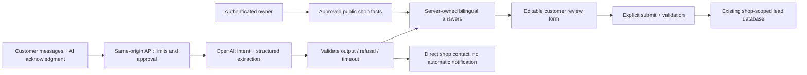

# v0.3 AI receptionist

## What is implemented

The private server uses OpenAI's Responses API to interpret English, Spanish, and mixed-language customer messages into a strict schema: intent, uncertainty, service, vehicle, preferred date, and time window. The language buttons control response language. The model never accesses leads, passwords, calendar tools, or customer contact fields. Its output cannot book appointments or save a lead.

Business answers are rendered by server-owned bilingual templates using only owner-approved hours, address, contact, and supported services. Model-written prose is never displayed as a business claim. Unknown information, price requests, uncertainty, unsupported services, refusals, and provider failures show a direct-contact handoff. Safety classifications show a general safety message. Classification can still be wrong: this is a supervised text pilot, not an emergency service or diagnostic tool.

Customers explicitly acknowledge sending chat messages to OpenAI. They are asked to leave names, contact information, VINs, and sensitive details out of chat. A “Review request” action transfers suggested fields into an editable form. Contact details and submission consent are collected there, and the existing server validates the final request. No appointment is confirmed and no message is sent merely by chatting. Handoff displays the shop contact; it does **not** page an employee or create a lead automatically.

## Connect privately

1. Follow [server setup](SERVER.md) and create your own owner account.
2. Put `OPENAI_API_KEY` in the server's ignored `.env` or hosting secret store. Never paste it into source, browser settings, or a public issue. Configure provider billing separately.
3. Set `OPENAI_MODEL` to a Responses/strict-structured-output compatible model available in your API account. The configurable starting default is `gpt-4o-mini`; it is not a claim about the newest model or access on your account.
4. Set `AI_DAILY_LIMIT` (default 100 per shop) and `AI_GLOBAL_DAILY_LIMIT` (default 300 across this database), then restart the server. Configure provider-side spending limits too.
5. Sign in, expand **Receptionist settings**, enter public business information, select offered services, acknowledge approval, and save with AI enabled. No fabricated shop facts are enabled by default. Both approval and a configured key are needed.
6. Reload the customer page. Try a fictional conversation, review its draft, and submit only if you intend to create a request. A configured-key label is not proof of a working API account.

For local development: `npm run build:server` followed by `npm start`. GitHub Pages cannot run this AI backend; the public demo deliberately keeps the original guided assistant.

## Evaluation and actual validation status

`npm run check` runs deterministic tests and both builds without external calls or credentials. Tests inject provider responses to exercise schema enforcement, refusal/errors, English/Spanish answer boundaries, shop authorization, consent, usage caps, and request validation. These tests **do not measure a live model's comprehension**.

`evals/receptionist.json` contains 16 fictional English, Spanish, mixed-language, correction, date, safety, unsupported-service, privacy, and prompt-injection scenarios. To explicitly authorize 16 billable external calls after configuring the key:

```sh
RUN_LIVE_AI_EVAL=yes npm run eval:ai
```

The command prints only case IDs and pass/fail, uses a fixed reference date, and exits nonzero on failure. It is excluded from CI and normal tests. It calls the provider directly, so these 16 evaluation calls are outside runtime database quotas. Passing is an initial regression gate, not a complete safety/quality assessment. Review failures, conduct human bilingual review, and test on the chosen model before a customer pilot.

**No live provider evaluation has been performed for this release because no key is configured.** Backend/UI checks use a clearly identified mock where needed; they must not be described as real AI results.

## Privacy and limits

- Chat is kept in browser component memory only. Refresh/navigation clears it. AutoFlow does not persist or log chat transcripts. The full bounded customer history is resent each turn.
- `store:false` is sent to the provider; this does not promise zero provider retention. Review the [OpenAI data controls](https://platform.openai.com/docs/guides/your-data) for your account before collecting real messages.
- The owner’s business facts remain in SQLite. Customers see approved public answers/contact. These facts are not submitted as model instructions.
- Limits: 8 customer messages per conversation, 600 characters each, 500 output tokens, 12-second provider timeout, 20 requests per socket IP/hour, two concurrent provider requests per process. No automatic provider retries.
- Daily call reservations are atomic, per shop and global, in SQLite; they reset at UTC midnight and survive server restarts. Failed calls consume reservations conservatively. Counts are not currency budgets. The eval command has separate opt-in, as noted above.
- Rate limits using socket IP may group all visitors behind a reverse proxy. Add a trusted edge rate limiter before exposing a pilot. Never blindly trust forwarded IP headers. Global concurrency is per process; this app is designed for one Node process with one durable database.
- Schema migration 2 adds `shop_knowledge` and `ai_usage` without rewriting existing leads. Usage counters older than 31 days are pruned; backups expire separately. Back up before upgrading.
- No automatic SMS, calling, CRM, calendar booking, payments, or staff notifications. Those remain later milestones.

## Architecture



Official integration reference: [Structured outputs](https://developers.openai.com/api/docs/guides/structured-outputs). The app uses `text.format` with `json_schema`, strict schema adherence, and explicit refusal/incomplete-response handling.
